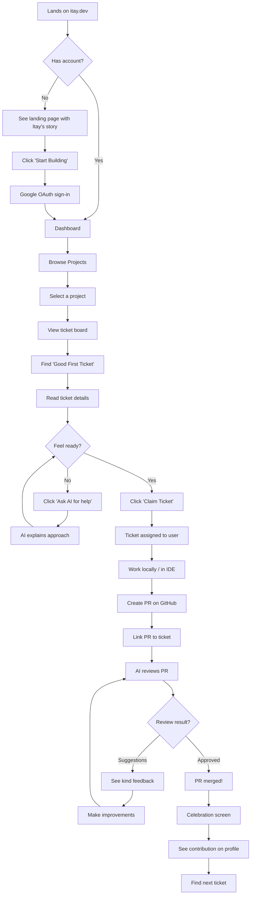
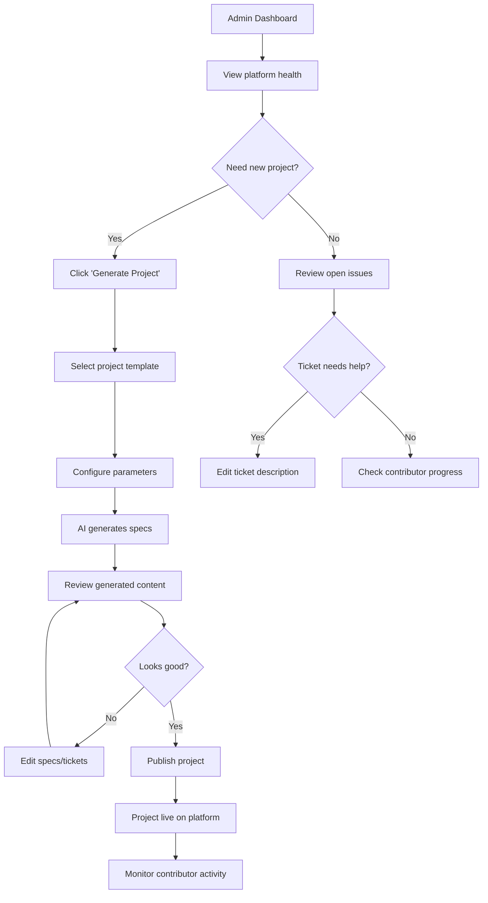

# UX Design Specification - Itay.dev

**Author:** yaniv
**Date:** 2026-01-01

---

## Executive Summary

### Project Vision

Itay.dev solves the "experience paradox" for junior developers through AI-generated projects with complete specs, tickets, and team collaboration. It's the on-ramp to production experience that doesn't exist anywhere else.

### Target Users

**Primary: The Stuck Junior**
- Frustrated developers stuck in tutorial hell
- Need real PRs, real code review, real shipped products
- Success = walking into interview with verified contributions

**Secondary: Career Switcher**
- Professionals transitioning to tech
- Need to prove they can work in modern dev environment
- Success = feeling "I already know how this works"

### Key Design Challenges

1. **Low intimidation onboarding** - First ticket should feel achievable, not scary
2. **AI integration UX** - Code review and ticket help must feel supportive, not judgmental
3. **GitHub bridge** - Platform to PR to merge flow must be seamless
4. **Admin experience** - Project generation and management must be efficient

### Design Opportunities

1. **Celebration of progress** - Every PR merged is a win worth celebrating
2. **Portfolio showcase** - Profile that makes employers say "this is impressive"
3. **Warmth and humanity** - Itay's spirit of people helping people in every interaction

---

## Core User Experience

### Defining Experience

The core loop is: Browse → Claim → Build → Submit → Review → Merge → Celebrate

Everything should flow toward getting that first PR merged as quickly as possible. The "time to first contribution" is the key metric for UX success.

### Platform Strategy

| Aspect | Decision |
|--------|----------|
| Primary platform | Web (responsive) |
| Primary device | Desktop (developers coding) |
| Input method | Mouse/keyboard |
| Offline | Not required |

### Effortless Interactions

- **Claiming tickets**: One click, no friction
- **AI assistance**: Contextual, inline, non-intrusive
- **GitHub linking**: Auto-detect PRs, minimal input
- **Progress tracking**: Automatic, no manual updates

### Critical Success Moments

1. First ticket claimed → Confidence boost
2. First AI review received → Feeling supported
3. First PR merged → Achievement unlocked
4. Profile shows work → Portfolio proof

### Experience Principles

1. **Speed to first win** - Optimize everything for fast first contribution
2. **Support, not judgment** - AI helps, never criticizes
3. **Visible progress** - Every action moves the profile forward
4. **Low intimidation** - Nothing should feel scary or overwhelming

---

## Desired Emotional Response

### Primary Emotional Goals

**"I can do this. Someone's got my back. Look what I built."**

Users should feel:
1. **Capable** - The platform believes in them even when they doubt themselves
2. **Supported** - AI and community are helpers, not judges
3. **Proud** - Every contribution is worth celebrating
4. **Validated** - Their work matters and is real

### Emotional Journey Mapping

| Stage | Emotion | Design Implication |
|-------|---------|-------------------|
| Discovery | Curiosity + Hope | Clear value prop, welcoming tone |
| First visit | Safe + Invited | Low barriers, no judgment |
| First ticket | Confident | "You can do this" messaging |
| Working | Focused + Supported | AI help accessible, not intrusive |
| Review | Encouraged | Kind feedback, growth-oriented |
| Merge | Proud + Accomplished | Celebration moment |
| Profile | Validated | Proof that matters |

### Micro-Emotions

- **Confidence over Confusion** - Every UI element should be clear
- **Trust over Skepticism** - AI is on your side
- **Accomplishment over Frustration** - Small wins everywhere
- **Belonging over Isolation** - Itay's legacy of people helping people

### Emotional Design Principles

1. **Kindness first** - Every word, every interaction, every AI response
2. **Celebrate progress** - No contribution is too small to acknowledge
3. **Never shame** - Mistakes are learning, not failures
4. **Warmth of Itay** - This platform loves developers

---

## UX Pattern Analysis & Inspiration

### Inspiring Products Analysis

| Product | UX Strength | Apply To Itay.dev |
|---------|-------------|-------------------|
| **GitHub** | Contribution graph, PR workflow, profile as proof | Profile visualization, familiar PR patterns |
| **Linear** | Clean minimal UI, keyboard shortcuts, dev-focused design | Ticket board aesthetics, keyboard navigation |
| **Exercism** | Kind mentorship tone, progress tracking, welcoming | Supportive AI voice, visible progress |
| **Duolingo** | Celebration moments, streaks, low-pressure | Celebrate every merge, progress gamification |

### Transferable UX Patterns

**Navigation Patterns:**
- Linear-style keyboard shortcuts for power users
- GitHub-style contribution graph for profile

**Interaction Patterns:**
- One-click ticket claiming (no forms)
- IDE/CLI integration for frictionless coding start

**Visual Patterns:**
- Clean, minimal developer aesthetic
- Progress visualization that feels rewarding

### IDE/CLI Integration (Key Differentiator)

| Option | UX Benefit |
|--------|------------|
| "Open in VS Code" button | One click from browser to coding |
| CLI tool (`itay claim 123`) | Terminal-native workflow |
| VS Code extension | See tickets without leaving IDE |
| GitHub Codespaces | Zero local setup friction |

**Goal:** Minimize time from "I want to work on this" to "I'm writing code"

### Anti-Patterns to Avoid

- LeetCode's intimidating timer/pressure
- Complex multi-step onboarding flows
- Overwhelming dashboards with too much data
- Corporate/enterprise feel (keep it warm)

### Design Inspiration Strategy

**Adopt:** GitHub's contribution graph, Linear's clean aesthetic, Exercism's kind tone
**Adapt:** Duolingo's celebration (developer-appropriate, not childish)
**Innovate:** IDE/CLI integration for seamless dev workflow

---

## Design System Foundation

### Design System Choice

**Chakra UI** - A simple, modular, and accessible component library for React.

### Rationale for Selection

| Factor | Why Chakra UI |
|--------|---------------|
| **Speed** | Sensible defaults, less decision fatigue for solo dev |
| **Warm aesthetic** | Easy theming to create welcoming, non-corporate feel |
| **Accessibility** | Built-in a11y - kindness includes everyone |
| **Components needed** | Cards, Stacks, Grids perfect for ticket boards & profiles |
| **MCP support** | Official server for AI-assisted development |
| **Not corporate** | Avoids enterprise dashboard feel (unlike MUI) |

### Implementation Approach

```bash
# Install
npm i @chakra-ui/react @emotion/react

# Add MCP to Claude Code
claude mcp add chakra-ui -- npx -y @chakra-ui/react-mcp
```

### Customization Strategy

**Theme customization for Itay.dev:**
- Warm color palette (welcoming, not cold/corporate)
- Celebration colors for merge success moments
- Soft shadows and rounded corners (friendly feel)
- Typography that feels approachable

**Key components to leverage:**
- `Card` - Tickets, projects, profile sections
- `Stack/Grid` - Layout for boards and lists
- `Badge` - Difficulty labels, status indicators
- `Avatar` - User profiles
- `Progress` - Contribution visualization
- `Toast` - Celebration moments

---

## Visual Design Foundation

### Color System

**Primary Palette - "Warm Developer"**

| Role | Color | Usage |
|------|-------|-------|
| **Primary** | Warm Indigo (#5C6BC0) | Actions, links, focus states |
| **Primary Light** | Soft Lavender (#9FA8DA) | Hover states, backgrounds |
| **Secondary** | Coral (#FF7043) | Accents, highlights |
| **Success** | Celebration Green (#66BB6A) | PR merged! moments |
| **Background** | Warm White (#FAFAFA) | Main canvas |
| **Surface** | Soft Gray (#F5F5F5) | Cards, ticket boards |
| **Text** | Warm Dark (#37474F) | Readable, not harsh black |

**Why this palette:**
- Warm indigo = supportive, professional but not cold
- Coral accents = energy, optimism
- Green success = celebration of every merge
- Warm neutrals = inviting, not sterile

### Typography System

| Element | Font | Weight | Size |
|---------|------|--------|------|
| **Headings** | Inter | 600-700 | 24-32px |
| **Body** | Inter | 400 | 16px |
| **Code** | JetBrains Mono | 400 | 14px |
| **Small** | Inter | 400 | 14px |

**Rationale:** Inter is friendly, readable, developer-loved. JetBrains Mono for code blocks.

### Spacing & Layout Foundation

| Principle | Value |
|-----------|-------|
| **Base unit** | 8px |
| **Card padding** | 16-24px |
| **Section spacing** | 32-48px |
| **Border radius** | 8-12px (soft, friendly) |
| **Max content width** | 1200px |

**Layout feel:** Airy, not cramped. Generous whitespace. Cards with soft shadows.

### Accessibility Considerations

- All color combinations meet WCAG 2.1 AA contrast ratios
- Focus states visible and clear
- Text sizes minimum 14px for readability
- Color not the only indicator (icons + text for status)

---

## Design Direction Decision

### Directions Explored

Six distinct visual directions were explored:

1. **Warm & Human** - Cozy forum vibes, serif headings, warm beige/terracotta palette
2. **Indie & Personal** - Blog-like, handwritten notes, personal voice, Itay's story front and center
3. **Terminal Native** - Monospace, CLI-style, keyboard-first, developer-focused
4. **Playful & Gamified** - XP, badges, quests, levels, achievement-focused
5. **Clean Documentation** - Notion-inspired, wiki pages, table views, minimal
6. **Community Chat** - Discord-style, channels, real-time chat feel

### Chosen Direction

**Blend of Warm + Indie + Clean + Touch of Playful**

The design direction combines the best elements from multiple explorations:

| Element | Source | Application |
|---------|--------|-------------|
| **Warmth** | Direction 1 | Cozy colors, welcoming feel, "people helping people" |
| **Personal voice** | Direction 2 | Itay's story present, handcrafted feel, not corporate |
| **Clean organization** | Direction 5 | Notion-like clarity, easy navigation, scannable lists |
| **Celebration** | Direction 4 | Celebrate wins (confetti on merge), but no XP/levels |

### Design Rationale

**Why this blend works for Itay.dev:**

1. **Warmth honors Itay's legacy** - The platform is about people helping people, not cold productivity
2. **Personal voice builds trust** - Juniors need to feel welcomed, not processed through a system
3. **Clean organization reduces intimidation** - Easy to find tickets, understand status, navigate
4. **Celebration motivates** - Every PR merged is a real win worth acknowledging

**What we're avoiding:**
- Corporate SaaS aesthetic (cold, generic)
- Full gamification (feels like grinding, not building)
- Discord clone (already exists, not our value add)
- Terminal-only (excludes less technical users)

### Implementation Approach

**Visual Language:**
- Warm color palette (indigo + coral + warm neutrals)
- Friendly typography (Inter for body, consider serif for headings)
- Generous whitespace, soft shadows, rounded corners
- Personal copy ("Hey there" not "Welcome to")

**Key Moments:**
- **Landing**: Personal, Itay's story, clear value prop
- **Project browsing**: Clean cards, easy scanning
- **Ticket view**: Organized, AI help accessible but not intrusive
- **PR merged**: Celebration moment (confetti, encouraging message)
- **Profile**: Contribution proof, warm presentation of achievements

**Component Patterns:**
- Ticket cards with warm hover states
- "Building Together" sidebar showing active contributors
- Inline AI assistance (friendly, not robotic)
- Progress indicators (subtle, not gamified)

---

## User Journey Flows

### Journey 1: First Contribution (Tomer)

**Goal:** Junior developer goes from discovery to first merged PR



**Key UX Moments:**
- Landing page feels welcoming, not intimidating
- Ticket claiming is one click
- AI help is always accessible but not forced
- Celebration when PR merges (confetti moment)

### Journey 2: Admin Project Generation (Yaniv)

**Goal:** Admin generates and publishes new projects for contributors



### Journey Patterns

| Pattern | Usage | Implementation |
|---------|-------|----------------|
| **One-Click Actions** | Claim ticket, link PR | No confirmation modals for low-stakes actions |
| **AI Assistance Inline** | Ticket help, code review | Expandable panel, not popup |
| **Progress Visibility** | Ticket status, profile | Real-time updates, clear states |
| **Celebration Moments** | PR merged | Full-screen confetti, encouraging message |
| **Graceful Recovery** | Errors, stuck states | Clear message + suggested action |

### Flow Optimization Principles

1. **Time to first claim < 5 minutes** - Landing → claimed ticket should be fast
2. **AI never blocks** - Help is optional, never required to proceed
3. **Every action has feedback** - Visual confirmation for all interactions
4. **Errors are kind** - "Let's try again" not "Error 500"
5. **Progress is always visible** - User knows where they are in the journey

---

## Component Strategy

### Design System Components (Chakra UI)

| Chakra Component | Itay.dev Usage |
|------------------|----------------|
| `Card` | Project cards, ticket cards, profile sections |
| `Button` | Actions (Claim, Link PR, etc.) |
| `Badge` | Difficulty labels, status indicators |
| `Avatar` | User profiles, contributor list |
| `Stack/Grid` | Layouts, ticket boards |
| `Toast` | Success notifications |
| `Modal` | Confirmations (when needed) |
| `Input/Form` | Admin forms, search |
| `Tabs` | Project views, profile sections |
| `Progress` | Contribution visualization |
| `Skeleton` | Loading states |

### Custom Components

**TicketCard** - Display ticket with claim action, states: Available/Claimed/In Review/Done

**AIAssistPanel** - Inline AI help, expandable panel (not modal), friendly responses

**CelebrationOverlay** - PR merge celebration with confetti, stats, next actions

**ContributorSidebar** - Show who's building together, avatars + current activity

**ContributionGraph** - GitHub-style activity visualization for profiles

### Implementation Phases

1. **Core (MVP):** TicketCard, AIAssistPanel, CelebrationOverlay
2. **Community:** ContributorSidebar, ContributionGraph
3. **Enhancement:** Project variants, admin components

---

## UX Consistency Patterns

### Button Hierarchy

| Level | Style | Usage |
|-------|-------|-------|
| **Primary** | Solid coral/indigo, high contrast | Main actions: Claim Ticket, Link PR, Publish |
| **Secondary** | Outlined, subtle | Supporting: Cancel, View Details |
| **Ghost** | Text only | Tertiary: Learn more, Help |
| **Danger** | Red tones | Destructive: Unclaim, Delete (admin) |

**Button Copy:** Action-oriented, personal ("I'll take this one" not "Claim")

### Feedback Patterns

| Type | Visual | Tone |
|------|--------|------|
| **Success** | Green + confetti for big wins, toast for small | Celebratory: "You did it!" |
| **Error** | Warm red, soft | Kind: "Let's try again" not "Error" |
| **Info** | Blue, subtle | Helpful: "Quick tip..." |
| **Loading** | Skeleton + friendly message | Patient: "Getting that ready..." |

### Form Patterns

- Inline validation - Show feedback as user types
- Error messages below field, specific and helpful
- Required fields marked subtly, not aggressive asterisks
- Submit disabled until valid, with clear indication of what's missing

### Navigation Patterns

- **Primary nav** - Top bar: Projects, My Tickets, Profile
- **Breadcrumbs** - For nested views (Project → Ticket)
- **Back actions** - Always visible, never trap users
- **Keyboard shortcuts** - Power users (claim: `c`, help: `?`)

### Empty States

| Context | Message | Action |
|---------|---------|--------|
| No claimed tickets | "Ready to start building?" | Browse projects button |
| No contributions yet | "Your first PR is waiting!" | Find a ticket |
| No projects available | "New projects coming soon" | Get notified |

### Loading States

- Skeleton screens matching content layout
- Progressive loading - show what we have, load more
- Never block - users can navigate while loading

---

## Responsive Design & Accessibility

### Responsive Strategy

| Device | Priority | Approach |
|--------|----------|----------|
| **Desktop** | Primary | Full experience - developers code here |
| **Tablet** | Secondary | Functional for reviewing, browsing |
| **Mobile** | Tertiary | Profile viewing, notifications, quick actions |

**Desktop-first** - Core experience is coding, which happens on desktop. Mobile is for checking status, not writing code.

### Breakpoint Strategy

| Breakpoint | Width | Layout Changes |
|------------|-------|----------------|
| Mobile | < 768px | Single column, collapsed nav, simplified ticket cards |
| Tablet | 768-1024px | Two column where needed, touch-optimized |
| Desktop | > 1024px | Full sidebar, multi-column boards, all features |

### Accessibility Strategy

**Target: WCAG 2.1 AA**

| Requirement | Implementation |
|-------------|----------------|
| **Color contrast** | 4.5:1 minimum for all text |
| **Keyboard navigation** | Full keyboard support, visible focus states |
| **Screen readers** | Semantic HTML, ARIA labels |
| **Touch targets** | Minimum 44x44px for all interactive elements |
| **Focus indicators** | Clear, visible focus rings (not just color) |
| **Skip links** | Skip to main content option |

### Implementation Guidelines

**Responsive:**
- Use Chakra UI responsive props (`base`, `md`, `lg`)
- Relative units (rem) for typography
- Flexible grids, not fixed widths
- Test on real devices

**Accessibility:**
- Semantic HTML first (nav, main, article, button)
- ARIA only when HTML semantics insufficient
- Announce dynamic content changes
- Never remove focus outlines

